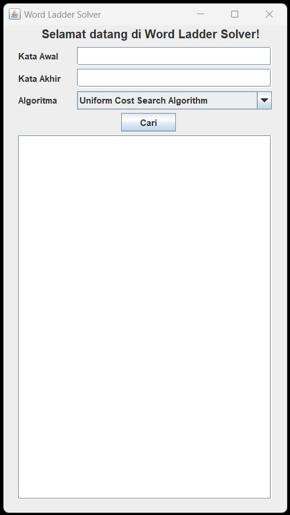
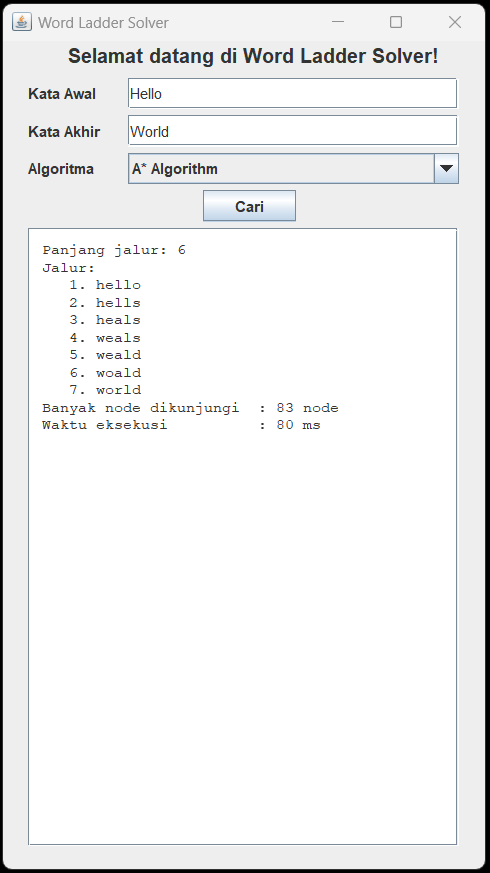

# Tucil3_13522006
Mata Kuliah IF2211 Strategi Algoritma 2024  
Penyelesaian Permainan Word Ladder Menggunakan Algoritma UCS, Greedy Best First Search, dan A*

## **Table of Contents**
* [Deskripsi Singkat](#deskrips-singkat)
* [Requirements](#requirements)
* [Cara Mengkompilasi Program](#cara-mengkompilasi-program)
* [Cara Menjalankan Program](#cara-menjalankan-program)
* [Screenshots](#screenshots)
* [Project Status](#project-status)
* [Room for Improvement](#room-for-improvement)
* [Author](#author)

## **Deskripsi Singkat**
Permainan Word Ladder adalah sebuah permainan teka-teki kata klasik di mana pemain mencoba mengubah satu kata menjadi kata lain dengan mengubah satu huruf pada satu waktu, menciptakan rangkaian kata yang valid dalam prosesnya. Setiap kata perantara dalam tangga harus merupakan kata yang valid dan terdefinisi di dalam kamus bahasa yang digunakan, dan setiap langkah hanya dapat mengubah satu huruf.

Program "Tucil3_13522006" merupakan sebuah program dalam bahasa Java untuk mencari solusi permainan Word Ladder dengan menggunakan Algoritma UCS (Uniform Cost Search), Greedy BeFS (Greedy Best First Search), dan A*.

## **Requirements**
Untuk menjalankan program ini, perlu menginstal **Java Environment** pada perangkat yang digunakan.

## **Cara Mengkompilasi Program**
1. Clone repositori ini.  
`$ git clone https://github.com/Agil0975/Tucil3_13522006.git `
2. Pindah ke direktori 'Tucil3_13522006'.  
`$ cd Tucil3_13522006 `
3. Jalankan perintah berikut di terminal untuk mengkompilasi program:  
`$ javac -d bin src/*.java`

## **Cara Menjalankan Program**
Jalankan perintah berikut di terminal untuk menjalankan program:  
`$ java -cp bin src.Main `

## **Screenshots**
Input:  

 Output:  

## **Project Status**
Project is: _complete_.

## **Room for Improvement**
Room for improvement:
- GUI Program
- Efisiensi Algoritma Pencarian 

## **Author**
| **NIM**  |       **Nama**        | **Kelas** |       
| :------: | :-------------------: | :------:  | 
| 13522006 |  Agil Fadillah Sabri  |   K02